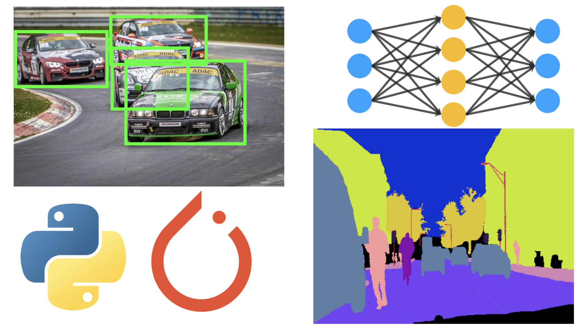

# Udemy-ComputerVision
Computer Vision in Action (Udemy Course)

**TOC**
 * § Section 1: Introduction
 * § Section 2: Recap of CNNs
 * § Section 3: Image classification
 * § Section 4: Object detection
 * § Section 5: Semantic segmentation
 * § Section 6: Instance segmentation
